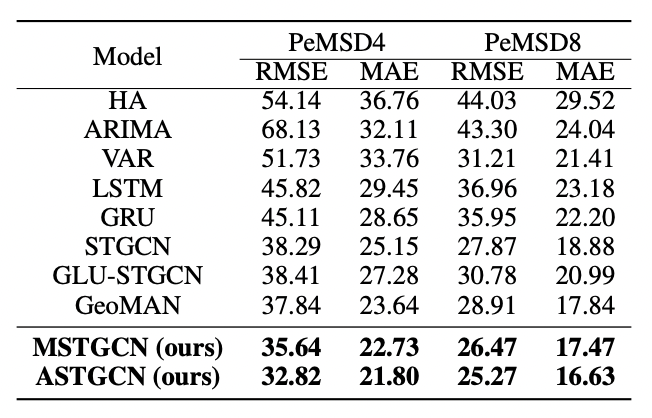

# traffic-pytorch
Integrated platform for urban intelligence tasks including traffic and demand prediction.

## Traffic prediction
We report MAE / RMSE in pems-bay dataset (12 steps / 1 hour).


| Model | MAE | RMSE |
|-------|--|--|
| [DCRNN](https://openreview.net/forum?id=SJiHXGWAZ) | 0.92 | 1.58 |
| [GMAN](https://aaai.org/ojs/index.php/AAAI/article/view/5477)| 1.99 | 3.87 |
| [WaveNet](https://www.ijcai.org/proceedings/2019/264)| 4.70 | 7.53 |

We report MAE / RMSE in PeMS dataset (9 steps).



| Model | MAE | RMSE |
|-------|--|--|
| [STGCN](https://www.aaai.org/ocs/index.php/AAAI/AAAI18/paper/view/17135)| 18.30 | 18.92 |
| [ASTGCN](https://ojs.aaai.org/index.php/AAAI/article/view/3881)| 2.94 | 5.50 |
| [MSTGCN](https://ojs.aaai.org/index.php/AAAI/article/view/3881)| 2.94 | 5.52 |

## Getting Started
### Data
- pems-bay, metr-la: Download h5 files from [Google Drive](https://drive.google.com/drive/folders/10FOTa6HXPqX8Pf5WRoRwcFnW9BrNZEIX) and place in datasets directory.
- PeMSD7: Download files from [STGCN Github](https://github.com/VeritasYin/STGCN_IJCAI-18) and place in datasets directory.
- PEMS: Download files from [ASTGNN Github](https://github.com/guoshnBJTU/ASTGNN) and place in datasets directory.


### Environment
``` 
conda create -n $ENV_NAME$ python=3.7
conda activate $ENV_NAME$

# CUDA 11.3
pip install torch==1.11.0+cu113 --extra-index-url https://download.pytorch.org/whl/cu113 
# Or, CUDA 10.2 
pip install torch==1.11.0+cu102 --extra-index-url https://download.pytorch.org/whl/cu102 
pip install -r requirements.txt
```

### Train
```
# DCRNN 
python train.py --model DCRNN --ddir ../datasets/ --dname pems-bay --device $DEVICE$ --num_pred 12

# GMAN
python train.py --model GMAN --ddir ../datasets/ --dname pems-bay --device $DEVICE$ --num_pred 12

# WaveNet 
python train.py --model WaveNet --ddir ../datasets/ --dname pems-bay --device $DEVICE$ --num_pred 12

# STGCN
python train.py --model STGCN --ddir ../datasets/ --dname PEMSD --device $DEVICE$ --num_pred 9

# ASTGCN
python train.py --model ASTGCN --ddir ../datasets/ --dname PEMSD --device $DEVICE$ --num_pred 9

# MSTGCN 
python train.py --model MSTGCN --ddir ../datasets/ --dname PEMSD --device $DEVICE$ --num_pred 9
```
